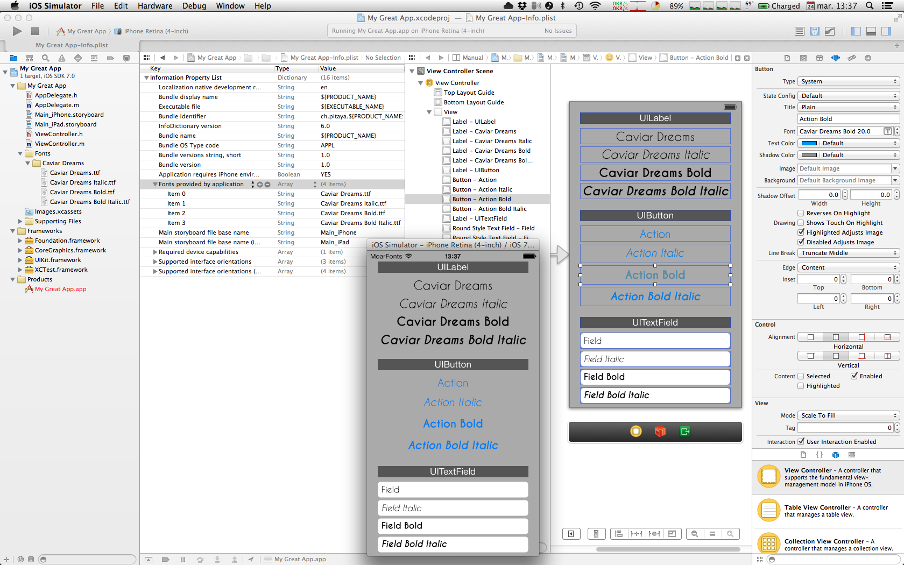

title: XCode iOS个性字体预览工具
date: 2013-11-11
tags: iOS, Xcode
---

# XCode iOS个性字体预览工具

在iOS3版本后，我们就可以在plist里面添加个性字体，从而让界面的显示不再仅限于Apple提供的默认字体集。但是，在开发中，无论是使用storyBoard还是xib，你是无法在XCode中直接预览字体显示样式的。

[MoarFonts](http://pitaya.ch/moarfonts/)允许你直接在XCode4或者XCode5中以插件的方式预览自定义字体。这个工具的目前报价为10美金，好像firstspring也支持人民币付款。

     

