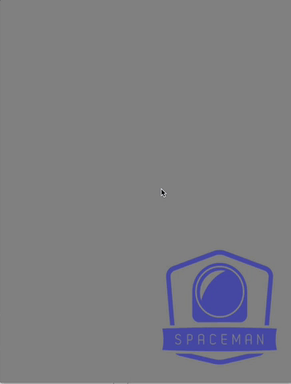

title: Cocoa 动画效果收集
tags: iOS, 动画
date: 2013-08-01
---

# Cocoa 动画效果收集

## SKBounceAnimation
[SKBounceAnimation](https://github.com/khanlou/SKBounceAnimation)为CAAnimation扩展出反弹动画效果，提供类似那种来回颤抖似的动画效果，它本身是从CAKeyAnimcation类中派生的，因为只能针对CALayer而不支持UIView。不过，项目主页中介绍了他的算法和思想，你也可以自己折腾一个支持UIView的类似动画。

## Squash
[Squash](https://github.com/Spaceman-Labs/Squash)同时为UIView和CALayer（这个好）提供形变动画效果，特别适用于拖拽中。

## UIView+EasingFunctions
[UIView+EasingFunctions](https://github.com/zrxq/UIView-EasingFunctions)其实不是动画效果，它是UIView的一个扩展，为UIView动画提供了各种[缓动函数](http://easings.net/zh-cn#)的算法实现。关于什么是__缓动函数__，可以移步[这里](http://easings.net/zh-cn)。关于缓动函数的实现，[这里](https://github.com/warrenm/AHEasing)还有一组实现库提供对CAAnimation的扩展。

## RBBAnimation
[RBBAnimation](https://github.com/robb/RBBAnimation)是基于关键桢动画上的封装，提供block风格的动画效果调用。页面上有各种演示效果。